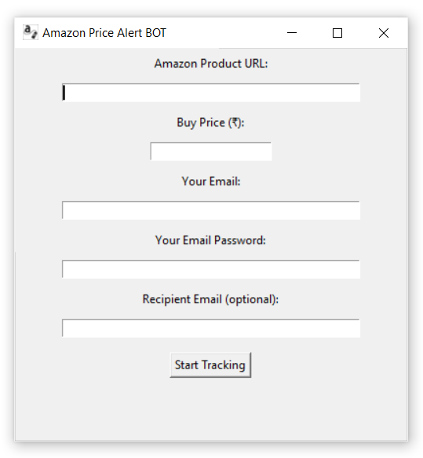

# 💰 Amazon Price Alert BOT – Catch the Best Deals Automatically

**Amazon Price Alert BOT** is a powerful yet simple desktop app that helps you monitor product prices on Amazon and get alerted when they drop.  
Whether you're tracking for yourself or someone else, this tool ensures you never miss out on a great deal again!

---

**The Mission:**  
This app is built to take the stress out of bargain hunting.  
By automating price checks and sending real-time alerts, it helps users save money while staying productive — no need to keep refreshing Amazon pages!

---

## 💻 Download for Windows

🔗 [Download Now!](https://github.com/mshikebkhan/amazon-price-alert-bot/releases/download/v1.0.0/AmazonPriceAlertBOTSetup.exe)

---

## 🚀 Features

💸 **Automatic Price Tracking** – Enter the product URL, set your desired price, and let the app track it for you.  
📩 **Email Notifications (Optional)** – Receive alerts via email when the price drops — even on behalf of a friend.  
🔔 **Desktop Notifications** – Get real-time pop-up alerts without checking your inbox.  
🧠 **User-Friendly Interface** – Simple GUI built with Tkinter for quick setup.  
🔄 **Background Checks** – Automatically checks prices every hour without user input.  
🔐 **Optional Email Config** – Custom email support with secure SMTP configuration.

---

## 📸 Screenshots

| Screenshot | Description |
|------------|-------------|
|  | Main Window – Input Amazon URL and set target price |

---

## 🛠 Tech Stack

- **Language:** Python  
- **GUI:** Tkinter  
- **Scraping:** BeautifulSoup (from `bs4`)  
- **Notifications:** `smtplib`, desktop popup  
- **Build Tool:** PyInstaller

---

## ⚙️ Local Setup

```bash
git clone https://github.com/mshikebkhan/amazon-price-tracker.git
cd amazon-price-alert-bot
python main.py
```
---

## 👥 Contributing

1. Fork the repository
2. Create your feature branch: `git checkout -b feature-name`
3. Commit your changes
4. Push to your branch
5. Open a Pull Request 🚀

---

## 📌 TODO Ideas

- Add desktop pop-up notifications
- Add support for Flipkart or other sites
- Show product image, current price, or graph
- Or anything else you think of!

---

## 📄 License

[MIT License](LICENSE)

---

Made with ❤️ by Shikeb Khan
